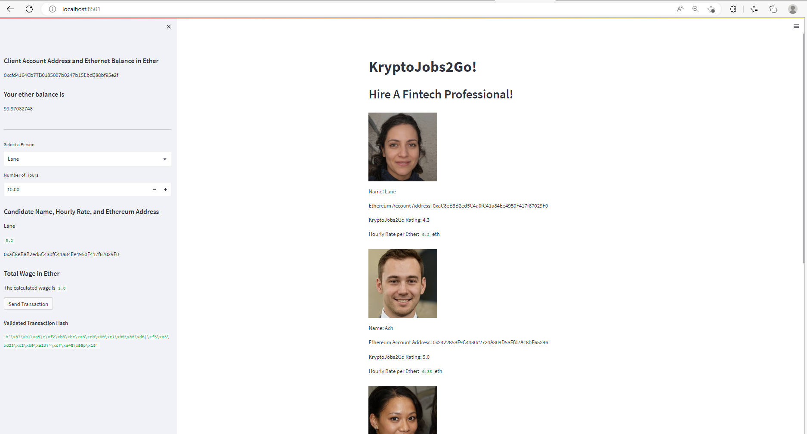
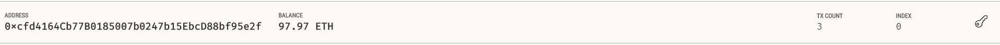
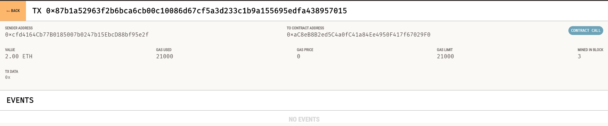

# Cryptocurrency-Wallet

## BackGround
KryptoJobs2Go is an application used to find, hire and pay fintech professionals.  In this project, an Ethereum blockchain network is intergrated into the application to enable customers pay the FinTech professionals instantly using cryptocurrency. 

Two files were used, [crypto_wallet.py](https://github.com/Mkarandi/Cryptocurrency-Wallet/blob/main/crypto_wallet.py) and [krypto_jobs.py](https://github.com/Mkarandi/Cryptocurrency-Wallet/blob/main/krypto_jobs.py). The crypto_wallet file contains the Ethereum transaction functions while krpto_jobs file contains code compatible with Streamlit Library and thus creating the web interface. Integrating these two files will allow for the automation of the tasks associated with generating a digital wallet, accessing Ethereum account balances, and signing and sending transactions via a personal Ethereum blockchain called Ganache.

We took the perspective of a Fintech Finder customer in order to do the following:

* Generate a new Ethereum account instance by using the mnemonic seed phrase provided by Ganache.

* Fetch and display the account balance associated with your Ethereum account address.

* Calculate the total value of an Ethereum transaction, including the gas estimate, that pays a KryptoJobs2Go candidate for their work.

* Digitally sign a transaction that pays a KryptoJobs2Go candidate, and send this transaction to the Ganache blockchain.

* Review the transaction hash code associated with the validated blockchain transaction.

Once transaction’s hash code is received, navigate to the Transactions section of Ganache to review the blockchain transaction details. 

## Screenshots
### Streamlit Web Interface

### Ganache Screenshots

## Contributors

Arandi M

